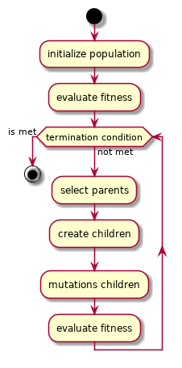

<h2>Table of Contents</h2>

<ul>
<li><a href="#org5560860">1. Description</a></li>
<li><a href="#orgad74a93">2. Algorithm overview</a></li>
</ul>

# Description

Small js application using genetic algorithm to place 8 queens on a chess board. All the examples I found on the internet where unnecessarily complicated and long. This aims to be dumb and short, but effective.

# Algorithm overview

The algorithm is kept very simple.

